# Obsidian-Librarian

> [!summary]
> A personal AI librarian for your Obsidian vault. A **read-only RAG pipeline** parses, splits,
> embeds, retrieves, reranks, and **generates** grounded answers from your notes; a **LangGraph
> agent** reasons over those tools, talks to you, and controls the vault — create, edit, delete
> notes — through the Obsidian plugin. Ships as **one Docker container that runs anywhere**.

Two halves you can read independently:

- **[Part A — The RAG Pipeline](#part-a--the-rag-pipeline)** — turns the vault into grounded answers. **Read-only.**
- **[Part B — The Agent](#part-b--the-agent)** — reasons, talks to you, and controls the vault.

Shared context (flow, stack, container, skeleton, build sequence) comes first.

---

## What this is

You keep notes in Obsidian (a folder of markdown files). Obsidian-Librarian indexes that folder,
answers questions across all your notes with citations, and acts on your vault when you ask.

- **Consumer:** you (single user), via **Open WebUI** or the **Obsidian Copilot** chat plugin.
- **Hard constraints:** the vault is real files (writes are real); embeddings stay **local**; the app runs as **one container** with only API keys as external dependencies.

> [!example] What using it feels like
> In Obsidian's Copilot pane you pick the "Obsidian Librarian" model and chat. Ask *"what did I
> conclude about X across my notes?"* → it searches and answers with clickable `[[wikilink]]`
> citations. Say *"make a MOC for X linking the 5 best notes"* → it proposes the note + diff → you
> reply *"yes"* → the file appears in your vault instantly. One chat pane, inside the app you already have open.

> [!important] The boundary that defines the system
> **The RAG pipeline never writes; the agent does all writing.** The pipeline's only job is to feed
> the agent grounded information; the agent is the only thing that creates, edits, or deletes notes
> (through the Obsidian plugin).

## The whole flow at a glance

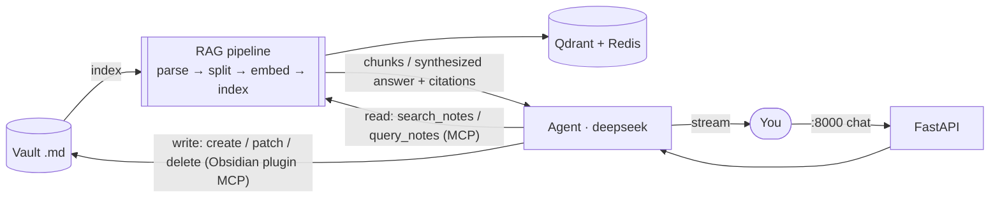

**Who owns each step:** *we* write the reader glue, the sync, the RAG-MCP, the graph, and the
Obsidian skill file. *LlamaIndex* owns parse/split/embed/retrieve/synthesize. *LangGraph* owns the
agent loop. *The Obsidian plugin* owns the actual vault writes. *Qdrant / Redis* run underneath.

> [!important] Two seams
> **Seam 1 — MCP:** the agent reaches everything through MCP tools — the **RAG-MCP** (ours, read)
> and the **Obsidian plugin MCP** (write/control). **Seam 2 — FastAPI:** you reach the agent through
> one OpenAI-compatible chat endpoint. Chat flows over FastAPI; all vault work flows over MCP.

## The stack (locked)

| Layer | Tool | Why |
|---|---|---|
| Agent orchestration | **LangGraph + LangChain** | Graph loop, tool-calling, checkpointer memory |
| LLM (agent reasoning + RAG synthesis) | **`deepseek-v4-pro:cloud` via Ollama Cloud** | Strong reasoning; reached via `ChatOllama` (`langchain-ollama`) — cloud host in `base_url`, `OLLAMA_API_KEY` as a bearer header in `client_kwargs`, model id in `model` |
| LLM judge (RAG evals) | **`glm-5.2:cloud` via Ollama Cloud** | Ragas LLM-metric judge — a *different* model from the generator, so it never grades its own output |
| Dense embeddings | **`nomic-embed-text-v1.5` via FastEmbed** | In-process ONNX — local + free, no model server; vault never leaves the box; also Ragas's embedding metrics |
| Sparse + rerank | **FastEmbed** (BM25 sparse + cross-encoder rerank) | In-process ONNX; exact-term recall + precision, no extra server. Shares one model cache with the dense embedder |
| Vector store | **Qdrant** (bundled) | **Dense + sparse per point**, server-side fusion (RRF) |
| Raw docstore + dedup | **Redis** (bundled) | Full raw markdown for citations + content-hash dedup |
| Sync watermarks | **SQLite** | Embedded per-file change detection, no service |
| RAG framework | **LlamaIndex** | Reader, node parser, ingestion, hybrid retriever, response synthesizer |
| Reader | **`llama-index-readers-obsidian` (`ObsidianReader`)** | Wikilinks, backlinks, folder, tasks → metadata; extend for `#tags`/frontmatter |
| Agent read tools | **FastMCP (RAG-MCP)** | Retrieval + query exposed to the agent, read-only |
| Agent write tools | **Obsidian Local REST API plugin's MCP** | Surgical PATCH, active note, commands, link integrity — boots with Obsidian |
| Scheduler | **APScheduler** | Periodic vault re-sync |
| Model runtime | **Ollama** (local, bundled) for embeddings; **Ollama Cloud** (API) for LLM + judge | Embeddings run in-container at `localhost:11434`; cloud LLM + judge are `ChatOllama` calls over `langchain-ollama` (cloud host in `base_url`, `OLLAMA_API_KEY` as a bearer header in `client_kwargs`). Models download on first run |
| RAG evals | **Ragas (non-LLM + LLM) + LlamaIndex + golden set** | Offline retrieval + generation quality; LLM metrics judged by `glm-5.2:cloud` |
| Agent evals | **golden set + Langfuse** | Task success, tool-choice, traces/scores |
| Interface | **FastAPI OpenAI-compatible endpoint** | One URL → Obsidian Copilot + Open WebUI |
| Config | **pydantic-settings + `.env`** | Env-driven |
| Packaging | **Single Docker image + supervisord** | Runs anywhere; one artifact |

## Single-container architecture (runs anywhere)

Our app — Qdrant, Redis, RAG-MCP, agent, API — lives in **one image**. The **Obsidian plugin
MCP runs in your Obsidian on the host**; the container reaches it for writes. Only API keys are external.

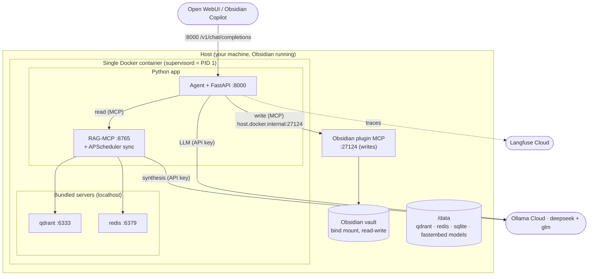

| Piece | Job | Runs | Always on? |
|---|---|---|---|
| `supervisord` | Start & supervise the container | PID 1 | yes |
| Ollama Cloud (`deepseek` + `glm`) | LLM generation + eval judge | **external API** (key) | on call |
| Qdrant | Dense + sparse vectors, fusion | Bundled binary, `127.0.0.1:6333` | yes |
| Redis | Raw docstore + dedup | `redis-server`, `127.0.0.1:6379` | yes |
| RAG-MCP + APScheduler | Read tools (search/query) + sync | Python, `127.0.0.1:8765` | yes |
| Agent + FastAPI | Chat + reasoning + tool calls | uvicorn, `0.0.0.0:8000` | yes |
| **Obsidian plugin MCP** | Vault writes/control | **Host Obsidian**, `:27124` | when Obsidian is open |

> [!warning] Reads run anywhere; writes need Obsidian open
> Indexing, retrieval, and Q&A are fully headless. **Vault writes go through the Obsidian plugin, so
> they require Obsidian running** with the Local REST API plugin (it boots with Obsidian — no extra
> effort). The container reaches it at `host.docker.internal:27124` with a bearer token over its
> self-signed TLS — so on Linux pass `--add-host=host.docker.internal:host-gateway`, and trust the
> cert (or set `OBSIDIAN_TLS_INSECURE`).

> [!example] Run it
> ```bash
> docker run -p 8000:8000 \
>   --add-host=host.docker.internal:host-gateway  # Linux: let the container reach host Obsidian \
>   -v /path/to/Vault:/vault  -v librarian-data:/data \
>   -e OLLAMA_API_KEY=...                       # Ollama Cloud (deepseek + glm) \
>   -e OBSIDIAN_MCP_URL=https://host.docker.internal:27124/mcp/ \
>   -e OBSIDIAN_API_KEY=...                      # plugin bearer token \
>   -e OBSIDIAN_TLS_INSECURE=true                # trust the plugin's self-signed cert \
>   -e LANGFUSE_PUBLIC_KEY=...  -e LANGFUSE_SECRET_KEY=...  \
>   obsidian-librarian
> ```
> Keys are noted by name only. **Embedding + rerank models download into `/data` on first run.**

---

# Part A — The RAG Pipeline

> [!info] Part A in one line
> A full LlamaIndex query engine — **parse → split → embed → retrieve → rerank → generate** — exposed **read-only** to the agent. It never writes.

## The data / state it owns

| Entity | Lives in | Kept current by |
|---|---|---|
| Vault notes (`.md`) | Filesystem (vault mount) | You (Obsidian) + the **agent** via the plugin (Part B) |
| Sync watermarks (`path → sha256, mtime`) | SQLite (`/data`) | Every sync run (diff) |
| Raw docs + metadata | Redis (`/data`) | Upsert on change, purge on delete |
| Dedup content-hashes | Redis | Skip unchanged files |
| Dense **and** sparse vectors | Qdrant (`/data`) | Upsert on change, delete on removal |

## Ingestion — building the index

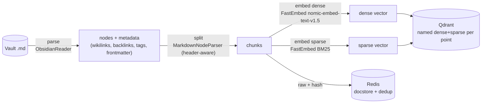

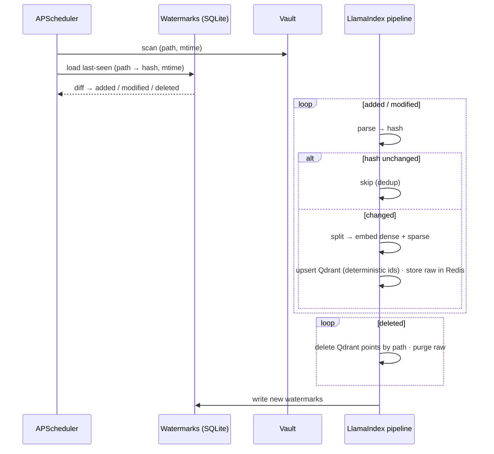

**CRUD, keyed on stable IDs** (`node_id = sha1(rel_path + "::" + chunk_index)`):

| Op | Trigger | Effect |
|---|---|---|
| Create | path not in watermarks | embed → upsert Qdrant, store raw, add watermark |
| Update | content hash changed | re-embed → upsert (overwrites same ids), replace raw |
| Delete | path gone on scan | delete Qdrant points by `path`, purge raw, drop watermark |
| No-op | hash unchanged | skip (dedup) |

> [!warning] Safety rules for sync
> **Deterministic IDs** → re-indexing is idempotent. **Watermarks are the single source of truth**
> for what's indexed; sync deletes are **index-only** and never touch your files.

## Query engine — retrieve → rerank → generate

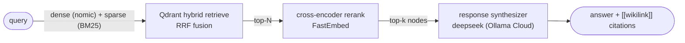

> [!important] The baseline is hybrid + rerank + generate — not dense-only
> Every query runs **dense + sparse fusion → rerank → synthesize**. Dense catches meaning, sparse
> catches exact names/jargon, the reranker fixes ordering, the synthesizer writes a grounded answer
> with citations. This full path is what makes Ragas evaluation possible.

## Phase walkthrough

| Phase | What happens | Tool |
|---|---|---|
| **Parse** | Read each note; pull text + wikilinks/backlinks/tags/frontmatter | `ObsidianReader` (+ our `#tags`/frontmatter extension) |
| **Split** | Header-aware; **≈512-token chunks, ~64 overlap (~12%)**, prefer heading boundaries, only size-split inside long sections. Each chunk keeps its heading path | `MarkdownNodeParser` |
| **Embed** | Dense (semantic) + sparse (lexical) per chunk. **Prepend nomic task prefixes** (`search_document:` on chunks, `search_query:` on queries) — FastEmbed does *not* add them itself, so we do. Embed a **title / heading-path / tags breadcrumb** with the text | FastEmbed `nomic-embed-text-v1.5` + FastEmbed BM25 |
| **Retrieve** | Hybrid search, server-side RRF fusion | Qdrant |
| **Rerank** | Cross-encoder re-scores the top-N | FastEmbed cross-encoder |
| **Generate** | Synthesize a grounded answer + **`[[wikilink]]` citations** | deepseek (Ollama Cloud) |

> [!note] Feed as much context as the pipeline can
> Chunks carry **all** their metadata — path, heading path, frontmatter, tags, wikilinks, backlinks —
> and the reranked nodes pass that metadata to the synthesizer. Answers cite sources as
> **`[[wikilinks]]`** so you can click straight to the note in Obsidian. Chunk size/overlap and top-k
> are config, tuned against the eval set.

## The RAG-MCP surface (read only, agent-only)

| Tool | Does | In → Out |
|---|---|---|
| `search_notes` | retrieve + rerank (**no** generation) | `query, k, filters` → ranked chunks + citations |
| `query_notes` | **full RAG** (retrieve + rerank + **generate**) | `query` → grounded answer + sources — **the path Ragas evaluates** |
| `get_note` | full raw note | `path` → markdown + metadata |
| `list_notes` / `get_backlinks` / `get_recent` | enumerate / graph / recency | → paths |
| `reindex` | force a sync | `path?` → status |

## RAG evals — Ragas (non-LLM + LLM) + LlamaIndex + golden set (offline, no Langfuse)

Ragas runs **both** metric families over the golden set; retrieval is measured separately by LlamaIndex.

| Kind | Judge? | Representative metrics |
|---|---|---|
| **Non-LLM** (deterministic) | none | `NonLLMContextRecall`, `NonLLMContextPrecisionWithReference`, `BleuScore`, `RougeScore`, `ExactMatch`/`StringPresence`, `SemanticSimilarity` (embeddings = `nomic-embed-text`) |
| **LLM** | **`glm-5.2:cloud`** | `Faithfulness`, `ResponseRelevancy`, `LLMContextPrecision`, `LLMContextRecall`, `AnswerCorrectness`, `AspectCritic` |
| Retrieval (LlamaIndex) | none | hit-rate, MRR, context precision/recall |

Wire: `ChatOllama("glm-5.2:cloud")` → `LangchainLLMWrapper` → `ragas.evaluate(llm=judge, embeddings=nomic)`.

> [!note] Three models, three roles — and the judge ≠ the generator
> `nomic-embed-text` **embeds** (pipeline + Ragas embedding metrics), `deepseek-v4-pro:cloud`
> **generates**, `glm-5.2:cloud` **judges**. Judging with a different model than the one that
> generated avoids self-preference bias. Ragas scores a **generated answer** against
> `question + contexts + ground_truth` — which is *why* the pipeline generates (`query_notes`) at all.
> A **golden set** (`evals/golden_set.jsonl`, incl. negative/unanswerable cases) over a fixed
> `sample_vault/` drives it; `make eval` prints scores and gates on thresholds. **The pipeline never
> uses Langfuse** — that's the agent's (Part B).

> [!example] Golden-set schema (`evals/golden_set.jsonl`)
> Per item: `question` · `ground_truth` (the ideal answer) · `reference_contexts` (the **actual gold
> snippets** that should be retrieved — the non-LLM context metrics compare *text to text*, so paths
> alone aren't enough) · `relevant_paths`. Negative cases carry empty `reference_contexts` and a
> "not in the vault" `ground_truth`.

---

# Part B — The Agent

> [!info] Part B in one line
> A LangGraph tool-calling agent that reasons over the RAG tools (read) and the Obsidian plugin tools (write), and knows Obsidian markdown cold.

## Anatomy at a glance

| Body part | In this agent | Built from |
|---|---|---|
| **Skeleton** | the graph: agent node ↔ tools node | LangGraph `StateGraph` / `create_react_agent` |
| **Brain / loop** | think → tool → observe → decide | deepseek + the `tools_condition` router |
| **Memory (within run)** | the message list | LangGraph state (`TypedDict`) |
| **Memory (across turns)** | resent history + a pending write carried by the checkpointer | `SqliteSaver` |
| **Hands** | RAG tools (read) + Obsidian plugin tools (write) | MCP via `langchain-mcp-adapters` |
| **Knowledge** | how to write Obsidian markdown correctly | the **Obsidian skill file** |
| **Voice** | how it talks to the model | `ChatOllama("deepseek-v4-pro:cloud")` + messages |
| **Heartbeat** | a chat message from you | the OpenAI endpoint on `:8000` |

## The loop (the brain)

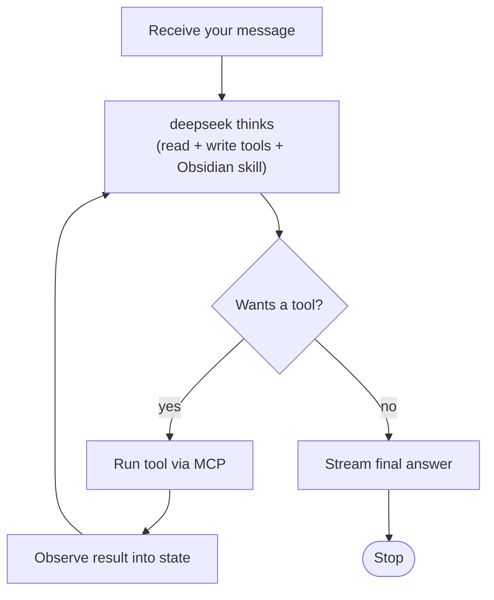

> [!important] Stop condition + guard
> **Stop:** deepseek emits no tool call. **Guard:** a hard **`recursion_limit`** (e.g. 12 laps) so it can't loop forever.

## The graph (the skeleton)

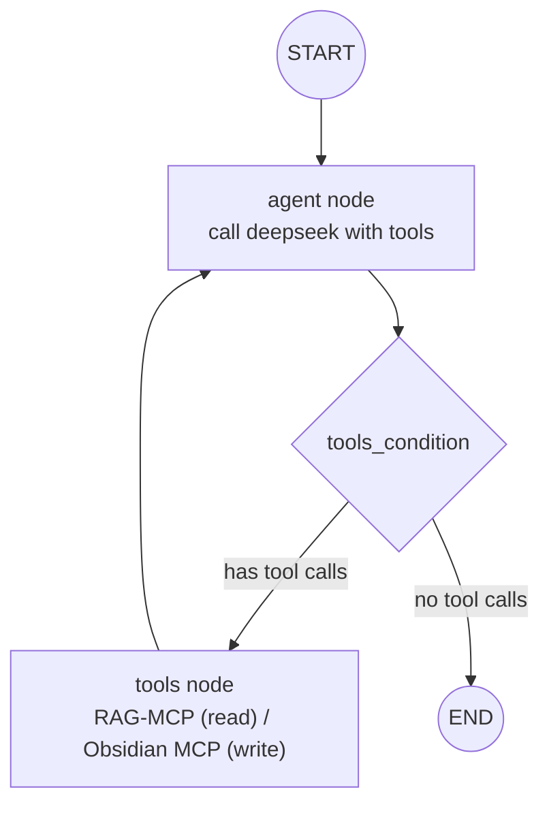

| Node | Job | Reads state | Writes state |
|---|---|---|---|
| `agent` | Ask deepseek what to do next | `messages` | appends AI message (maybe tool calls) |
| `tools` | Run requested MCP tools (read or write) | last AI message's tool calls | appends `ToolMessage`s |
| `tools_condition` | Route: tool calls → `tools`, else → `END` | last message | — |

## The state (the bloodstream)

```python
from typing import Annotated, Optional, TypedDict
from langgraph.graph.message import add_messages

class LibrarianState(TypedDict):
    messages: Annotated[list, add_messages]   # merged (appended), not overwritten
    pending_write: Optional[dict]             # set when a write needs approval
```

## The tools (the hands) — read + write, all via MCP

```python
from langchain_mcp_adapters.client import MultiServerMCPClient

client = MultiServerMCPClient({
    "rag":      {"url": "http://127.0.0.1:8765/mcp",              "transport": "streamable_http"},  # read (ours)
    "obsidian": {"url": "https://host.docker.internal:27124/mcp/","transport": "streamable_http"},  # write (plugin)
})
tools = await client.get_tools()   # search_notes, query_notes, ... , create/patch/delete note
```

| Tool | From | Does | World? |
|---|---|---|---|
| `search_notes`, `query_notes`, `get_note`, `get_backlinks`, `get_recent` | RAG-MCP (ours) | feed info | reads |
| create / update / **PATCH** (heading·block·frontmatter) / delete / append | Obsidian plugin MCP | write & organize | **changes** |
| active-note ops, run command | Obsidian plugin MCP | live control | **changes** |

> [!warning] Guard the write tools
> The agent **proposes-then-confirms** before any write (see "Confirming writes over chat" below):
> it streams the target + diff and waits for your "yes" on the next turn. Deletes honor Obsidian's own
> trash setting. Reads never confirm. A `WRITE_CONFIRM=false` config skips confirmation for trusted writes.

## The Obsidian skill file (makes it a specialist)

`agent/skills/obsidian.md` is loaded into the agent's system prompt so it writes/edits **correct
Obsidian-flavored markdown**:

- YAML **frontmatter / properties** (tags, aliases, cssclasses; typed fields: text/list/number/checkbox/date)
- **Wikilinks** `[[Note]]`, `[[Note|alias]]`, `[[Note#Heading]]`, `[[Note#^block]]`; **embeds** `![[...]]`
- **Tags** `#tag`, nested `#area/sub`; **callouts** `> [!note]`; **block refs** `^id`; **tasks** `- [ ]`
- How to target the plugin's **PATCH** ops (a heading, a block ref, or a frontmatter key)
- Vault conventions: folders, MOCs, daily/periodic notes

> [!note] Retained regardless of write path
> The skill file is about *how to write Obsidian correctly*, independent of *what performs the write*. It stays even though the plugin now does the writing.

## The organs — parts list

| Organ | Concept | Actual piece | Package |
|---|---|---|---|
| Skeleton | the graph | `create_react_agent` / `StateGraph` | `langgraph` |
| Brain / router | loop decision | `tools_condition` | `langgraph.prebuilt` |
| Memory (across runs) | persistence | `SqliteSaver` | `langgraph-checkpoint-sqlite` |
| Hands | tools | MCP tools as LangChain tools | `langchain-mcp-adapters` |
| Voice | model call | `ChatOllama("deepseek-v4-pro:cloud")` | `langchain-ollama` |
| Messages | conversation objects | `HumanMessage/AIMessage/ToolMessage` | `langchain-core` |
| Nerves | observability | Langfuse `CallbackHandler` | `langfuse` |

## One full run (walkthrough)

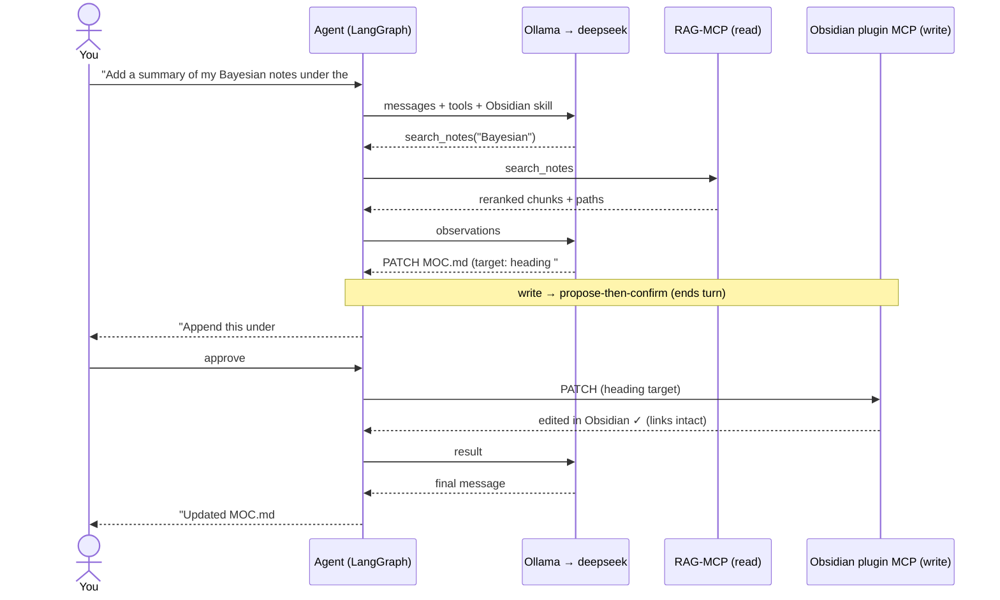

## Memory across runs

> [!note] Where memory comes from
> Chat clients (Open WebUI, Copilot) **resend the full conversation each turn**, so within-run and
> across-turn memory ride along in `messages` for free. The `SqliteSaver` checkpointer's real job is
> to **carry a pending write across the propose→confirm turns** and survive restarts; it's keyed by a
> `thread_id` derived from the conversation. Lives in `/data`.

## Interface / front door (Seam 2)

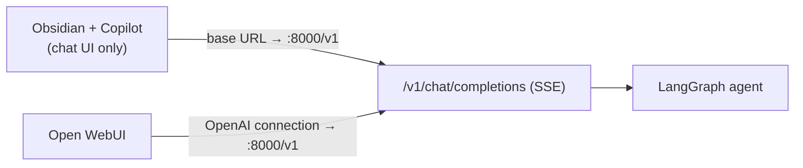

`POST /v1/chat/completions` (streaming) + `GET /v1/models`. **Chat flows here; all vault work flows
over MCP.** Copilot/Open WebUI just *talk* to the agent; the agent's control of the vault is the
Obsidian plugin MCP.

> [!important] Confirming writes over a stateless chat endpoint
> Chat clients send one message and expect one streamed reply — there's no side channel for "approve?".
> So writes use **propose-then-confirm**: when the agent wants to write, it streams the concrete plan
> (target note + diff, tagged with a machine-readable pending-action marker) and **ends the turn**. The
> client resends the whole history next turn, so the agent sees its own proposal + your reply; on
> "yes"/"apply" it executes the write via the plugin, otherwise it treats your message as a new
> instruction. No special `thread_id` juggling, works in any OpenAI-compatible client, and `WRITE_CONFIRM=false` skips it for trusted, immediate writes.

## Agent evals — golden set + Langfuse

Task success on golden tasks, with an explicit success rule per task type: **write tasks** run against
a throwaway temp vault and **assert the resulting file** (path + content/frontmatter); **Q&A tasks**
are scored for answer correctness (glm-5.2 judge or semantic match). Plus tool-choice correctness.
Langfuse `CallbackHandler` traces every run; scores land in Langfuse datasets for regression tracking.
**Langfuse covers the agent only.**

---

## Project skeleton

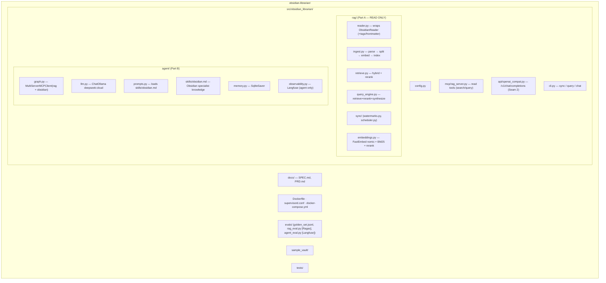

> [!note] No FS write code
> There is no `vault/writer.py` and no vault MCP server of ours — the **Obsidian plugin is the write server**. We only build the read side + the agent + the skill file.

## Build sequence (full system, dependency order)

> [!important] One-shot, A→Z — no walking skeleton
> Every component here is **core and in scope from the start**: hybrid retrieval, rerank, generation,
> RAG-MCP, plugin writes + HITL, FastAPI, scheduler, and both eval suites. The order below is
> **dependency order**, not incremental gating — nothing is "added later when a symptom appears."

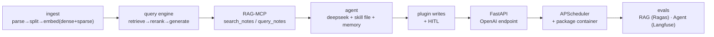

## Where we are

- [ ] **M0** Scaffold: repo, `pyproject.toml`, `config.py`, Dockerfile + supervisord (qdrant/redis), `docker-compose`, `sample_vault/`, **create `docs/PRD.md`** ← next
- [ ] **M1** Ingestion (ObsidianReader → split → embed dense+sparse → Qdrant; Redis raw+dedup; watermarks; deletes)
- [ ] **M2** Query engine (hybrid retrieve → rerank → synthesize) + `cli query`
- [ ] **M3** RAG-MCP (`search_notes`, `query_notes`, …)
- [ ] **M4** Agent (graph, deepseek, checkpointer, **Obsidian skill file**) + `cli chat`
- [ ] **M5** Wire Obsidian plugin MCP write tools + HITL approval
- [ ] **M6** FastAPI OpenAI endpoint → Obsidian Copilot + Open WebUI
- [ ] **M7** APScheduler auto-sync + package the single container
- [ ] **M8** Evals — RAG (Ragas non-LLM + LLM w/ `glm-5.2:cloud` judge + LlamaIndex, offline) · Agent (golden + Langfuse)

## Design choices — quick index

> [!question] Why does the pipeline generate (not just retrieve)?
> Ragas scores a generated answer against the golden set; without generation there's nothing to evaluate. The pipeline is a full query engine, and `query_notes` is the generating, evaluated path.

> [!question] Why is the baseline hybrid + rerank + generate, not dense-only?
> Notes are full of exact names, tags, and jargon; sparse recovers what dense misses, the reranker fixes order, and generation is required for both grounded answers and evals. Dense-only would be a worse product *and* un-evaluable.

> [!question] Why the Obsidian plugin for writes instead of the filesystem?
> The plugin boots with Obsidian (no extra effort) and gives surgical PATCH by heading/block/frontmatter, active-note access, commands, and link-integrity on rename — far more capable than raw file writes, and correct-by-construction.

> [!question] Why keep an Obsidian skill file if the plugin does the writing?
> The plugin performs writes; it doesn't decide *what correct Obsidian markdown looks like*. The skill file makes the agent format frontmatter, wikilinks, tags, and callouts correctly.

> [!question] Why deepseek via Ollama Cloud + local nomic-embed-text?
> Embeddings run local (the whole vault gets embedded — private + free); heavy reasoning + synthesis run in the cloud behind a key. Cloud models are a plain hosted-provider call (base URL + key + model) — no special routing.

> [!question] Why dense + sparse both in Qdrant (not sparse in Redis)?
> Qdrant fuses named dense+sparse per point server-side in one query; splitting forces manual fusion across two systems. Redis stays the raw-doc store + dedup.

> [!question] Why RAG=Ragas and Agent=Langfuse, separately?
> They evaluate different things: the pipeline's answer quality (Ragas, offline) vs the agent's task/tool behavior (Langfuse traces). Keeping them apart keeps each signal clean.

> [!question] Why judge with `glm-5.2:cloud` instead of the generator?
> A model grading its own output is biased toward it. Judging deepseek's answers with a different model (glm-5.2) keeps faithfulness/correctness scores honest.

> [!question] Why both non-LLM and LLM Ragas metrics?
> Non-LLM metrics are cheap, deterministic, and regression-friendly (BLEU/ROUGE/exact/semantic); LLM metrics catch what strings can't (faithfulness, relevancy). Together they're fast to trust and hard to fool.

> [!question] Why one-shot A→Z instead of a walking skeleton?
> The architecture is fully decided; every part earns its place now. Building it end-to-end at once avoids throwaway scaffolding and re-work.

## Defer until a trigger fires

> [!note] Out-of-scope for the product — not deferred core features
> Everything in the build sequence ships now. The rows below are genuinely separate concerns that stay off until their trigger fires.

| Defer | Trigger |
|---|---|
| Filesystem write fallback (headless writes) | you need the agent to write when Obsidian is closed |
| Auth on the endpoint | exposing `:8000` beyond localhost / trusted network |
| GPU embeddings / bigger local models | vault too large or CPU latency too high |
| Qdrant as a separate scaled service | > ~100k chunks, or replication/HA needed |
| Self-hosted Langfuse | can't use Cloud (data residency) |
| File-watch (watchdog) instant sync | interval sync feels too slow |
| Instant write→index refresh (post-write `reindex`) | the agent's own edits feel stale within a session |
| Endpoint auth + `127.0.0.1` binding | exposing `:8000` beyond your own machine |
| Supervisor + sub-agents | one agent + tools stops being enough |
